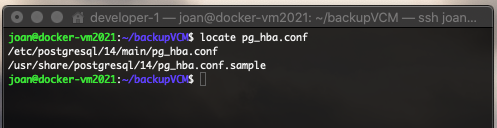
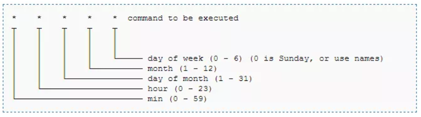

## PostgreSQL Back Up
[//]: 


## Introduction

Create a bash script for create a backup of database every 20 minutes.

- psql: psql is a terminal-based front-end to PostgreSQL. It enables you to type in queries interactively, issue them to PostgreSQL, and see the query results. 
- pg_dump: pg_dump is a utility for backing up a PostgreSQL database. It makes consistent backups even if the database is being used concurrently. pg_dump does not block other users accessing the database (readers or writers).
- pg_restore: pg_restore is a utility for restoring a PostgreSQL database from an archive created by pg_dump in one of the non-plain-text formats. It will issue the commands necessary to reconstruct the database to the state it was in at the time it was saved.

## Requeriments

- Write a bash script that allows create a backup of database every 20 minutes.

## Technologies

#### Command line

| [psql](https://www.postgresql.org/docs/current/app-psql.html) | [pg_dump](https://www.postgresql.org/docs/current/app-pgdump.html) | [pg_restore](https://www.postgresql.org/docs/current/app-pgrestore.html) |
| :----------------------------------: | :-------------------------: | :-------------------------: |

## Bash Script Configuration

### Postgresql installation:

We need to go to the next web page for copy the installation script [postgresql](https://www.postgresql.org/docs/current/app-pgrestore.html) on ubuntu. We add the script in the following block of code, but it is a good idea always copy from the source page because it might change in a near future.

```sh
# Create the file repository configuration:
sudo sh -c 'echo "deb http://apt.postgresql.org/pub/repos/apt $(lsb_release -cs)-pgdg main" > /etc/apt/sources.list.d/pgdg.list'

# Import the repository signing key:
wget --quiet -O - https://www.postgresql.org/media/keys/ACCC4CF8.asc | sudo apt-key add -

# Update the package lists:
sudo apt-get update

# Install the latest version of PostgreSQL.
# If you want a specific version, use 'postgresql-12' or similar instead of 'postgresql':
sudo apt-get -y install postgresql
```

### Posgresql configuration:

The next step is configure the auth login for "postgres" user, this is neccesary for the perfect perfomance of the script. In this version We use the same password of the .env file, the reason behind this is because the family postgres's commands (psql, pg_dump and pg_restore) use a global variable named "$PGPASSWORD", this global variable allow us run the previous commands without set the password in the terminal. Thanks to this option, We can execute the script in automatic mode every certain time.

#### Locating **hba.conf**:

Note that the location of this file isn't very consistent.

You can use 
```sh
locate pg_hba.conf 
```
Install the command "locate" if is necessary or ask PostgreSQL SHOW hba_file; to discover the file location.

#### Edit **pg_hba.conf** file:

You have to edit (with sudo, if is necessary) the file called pg_hba.conf located in:

```sh
/etc/postgresql/[your_version]/main
```

For example:



Inside the file, look for the following line (it's almost at the end, there are 4 almost identical lines but it's the first):

```sh
local   all   postgres   peer
```

(It will be separated with more spaces)

And change **peer** to **trust** so that it looks like this:

```sh
local   all   postgres   trust
```

Save changes and restart the server with:

```sh
sudo service postgresql restart
```

Now log in with the user postgres (later, you will be able to log in with another user after doing this).

```sh
psql -U postgres
```

Change your password with:

```sh
alter user postgres with password 'yourpasswordhere';
```

The password set for this script is the same used in the .env file. In the case that if is necessary set a different password, the script must be update with a new feature that satisfy that functionality. Close **psql** and edit the **pg_hba.conf** file again. Now edit the following line:

```sh
local   all   postgres   trust
```

It should look like this:

```sh
local   all   postgres   md5
```

Restart the server again:

```sh
sudo service postgresql restart
```

Try to login again. If this method doesn't work, specify the host.

### Contrab Configuration:

**Crontab** is a text file, it is a file with a special content and specifically designed so that it is read correctly by Cron and proceeds with the execution that we have programmed.

Using cron is through directly manipulating the */etc/crontab* file. On the default installation of various Linux distributions, this file will look something like the following:

```sh
# /etc/crontab: system-wide crontab
# Unlike any other crontab you don't have to run the `crontab'
# command to install the new version when you edit this file
# and files in /etc/cron.d. These files also have username fields,
# that none of the other crontabs do.

SHELL=/bin/sh
PATH=/usr/local/sbin:/usr/local/bin:/sbin:/bin:/usr/sbin:/usr/bin
MAILTO=root
HOME=/

# Example of job definition:
# .---------------- minute (0 - 59)
# |  .------------- hour (0 - 23)
# |  |  .---------- day of month (1 - 31)
# |  |  |  .------- month (1 - 12) OR jan,feb,mar,apr ...
# |  |  |  |  .---- day of week (0 - 6) (Sunday=0 or 7) OR sun,mon,tue,wed,thu,>
# |  |  |  |  |
# *  *  *  *  * user-name command to be executed
17 *    * * *   root    cd / && run-parts --report /etc/cron.hourly
25 6    * * *   root    test -x /usr/sbin/anacron || ( cd / && run-parts --repo>
47 6    * * 7   root    test -x /usr/sbin/anacron || ( cd / && run-parts --repo>
52 6    1 * *   root    test -x /usr/sbin/anacron || ( cd / && run-parts --repo>
#
```
The first four lines are variables that indicate the following:

- **SHELL**: It is the 'shell' under which the cron is executed. If not specified, the one indicated in the /etc/passwd line corresponding to the user who terminated cron will be taken by default.

- **PATH**: Contains or indicates the path to the directories in which cron will look for the command to execute. This path is different from the global system or user path.

- **MAIL TO**: It is who the output of the command is sent to (if it has any output). Cron sent a mail to whoever is specified in this variable, that is, it must be a valid user of the system or some other system. If not specified, then cron will provide the mail to the user who owns the command being executed.

- **HOME**: It is the root or main directory of the cron command, if it is not indicated then the root will be the one indicated in the /etc/passwd file corresponding to the user that executes cron.

We need to edit the file that owns the tasks. For this we are going to help ourselves with the *crontab -e* command. We have the following structure:



5 asterisks and the command to execute. Each of the 5 asterisks means:

- m: minute
- h: hour
- dom: day of the month
- mon: month
- dow: day of the week

We open the */etc/crontab* file with the next command:

```sh
crontab -e
```

We have the following file:

```sh
# To define the time you can provide concrete values for
# minute (m), hour (h), day of month (dom), month (mon),
# and day of week (dow) or use '*' in these fields (for 'any').
# 
# Notice that tasks will be started based on the cron's system
# daemon's notion of time and timezones.
# 
# Output of the crontab jobs (including errors) is sent through
# email to the user the crontab file belongs to (unless redirected).
# 
# For example, you can run a backup of all your user accounts
# at 5 a.m every week with:
# 0 5 * * 1 tar -zcf /var/backups/home.tgz /home/
# 
# For more information see the manual pages of crontab(5) and cron(8)
# 
# m h  dom mon dow   command
```
We add to the end of file the script We want to execute every 20 minutes, Additionally we add another task to delete old back up's directories each day:

```sh
*/20 * * * * /home/joan/scriptSshBdVcm/script.sh export remote > /dev/null 2> /tmp/crontab_script_log.txt 2>&1

0 0 * * * /home/joan/scriptSshBdVcm/script.sh directory > /dev/null 2> /tmp/crontab_script_log.txt 2>&1
```

Save and close, if is necessary restart *cron* service:

```sh
sudo service cron reload
```

### VCM BackUp Script:

This script export *Postgres Database* in a *.tar*. 

We have to assign execute permissions to be able to execute it correctly by Cron, otherwise it will not have execute permissions (Do not forget config your .env and add your database credentials):

```sh
chmod ugo+x script.sh 
```

Run the main script but first we need to specify 2 arguments.

Arguments:
- task: "import", "export" or "directory".
- method: For the first case "export", we need to pass "local" or "remote".
- dbflag: if send "import" as second argument. We only need to pass "1" if you want to create the database and role before import the *.tar* file. Pass any other number if this is not neccesary.
- filename_backup: If you want to import a specific backup file, you need to pass this argument with the absolute path of the .tar file. 

For export database:

Case 1: Export database task in local method.

```sh
./script.sh export local
```

Case 2: Export database task in remote method.

```sh
./script.sh export remote
```

For import database:

case 3: Import the last backup created.

```sh
./script.sh import remote 1
```

case 4: Import a specific backup (You need to pass absolute path of the backup file)

```sh
./script.sh import 1 remote /absolutepathtobackup/filename
```

Remove old backups directories:

case 5: Clear old backup directories.

```sh
./script.sh directory
```
## Contributors

This project was written by:

- Programmer :
  - [Joan de Jesús Méndez Pool](https://github.com/JJWizardMP)
